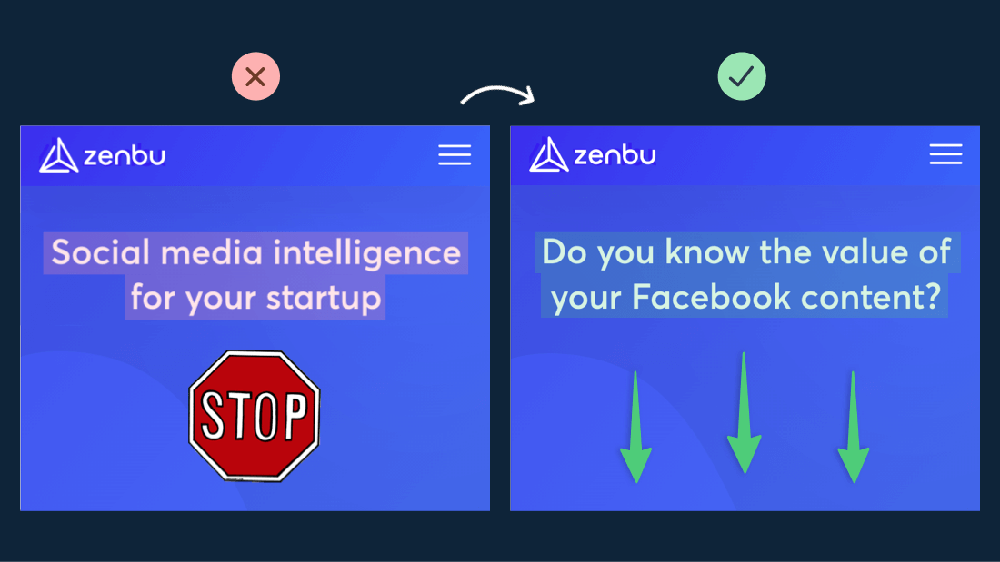
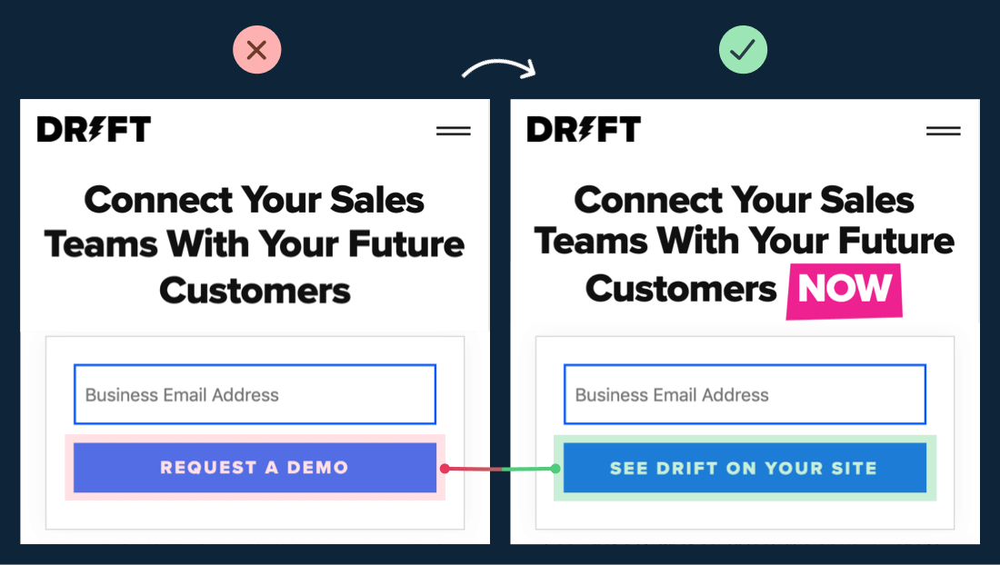

# How I would relearn productivity  (and a set of nocode tools I built around it)#[[articles draft]]
collapsed:: true
	- A bit about how I got started : end goal -> hardly anything
	- Your to-do list should not be built from thin air
	  collapsed:: true
		- use maybe list and then select the imp ones
		- u should only prioritise with a current state of mind
		- a lot of ppl treat creating a todo list as the 1st step. It is the second
		- Warren buffet pilot advice
		-
	- have an end goal. Then approach it in bursts
	  collapsed:: true
		- mountain climbing analogy. A robot will power through the climb without rest.
		- You are not a machine. You need to factor in fatigue, and storms
		- powering through when u are out of physical or emotional juice leads to burnout
		- each milestone -> pomodoro. Start with 20 minutes. Then build up your stamina
		- Keep a target in sight so u do not
			- get discouraged
			- misstep and lose track
		- take physical break after each
	- work with intense focus or don't work at all
		- [[Deep Work]] works. Exceptional results are only produced when in state of intense focus
		- shallow works puts you under the impression that you are working but chips away at time without producing any worthwhile results
	- keep a logbook and always be recording
	- distractions and mental residues
		- take break from focus. Not from
	-
# [[Copywriting]] tips #writing #blog
collapsed:: true
	-
	  1. Write with your eraser
	  2. Not what you do, but what you do for them
	  3. Avoid passive voice
	  4. Don't kill your personality
	  5. Write some thing that pulls the reader down your page 
	  6. Avoid “landing page words” . Unlock, unleash, enhance, empower, supercharge, etc.
	  7. Kill adverbs 
	  8. Don’t romanticise it. The goal is to inspire action 
	-
	-
# 1-2-1 Strategy for [[Deep Work]]
	- helps you be a wildly productive creator
	- what a peak day looks like under this strategy :
		- 3k+ words, 20+ ideas in less than 4 hours of deep work
	- day one : caffeine  induced sprint
		- consume caffeine only for work
		- microdose use this half-life period calculator to see how long you need to wait.
	- day 2 & 3 : Effortless work
		- simple tasks -> review, edit, record
		- start small
		- use other triggers like music on this day
	- day 4 : assigned play
		-
-