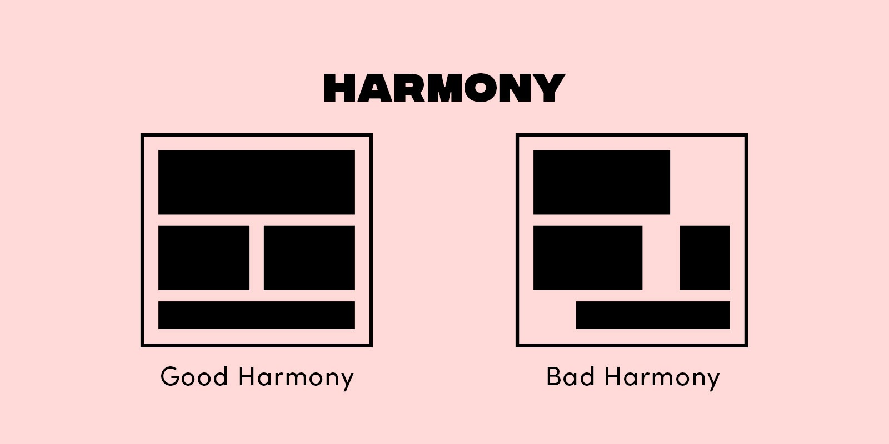
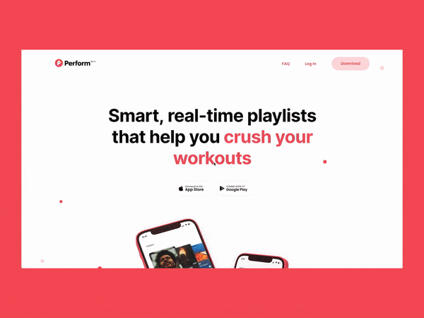

- # How to calculate web design hourly rate
	- https://www.flux-academy.com/blog/how-to-calculate-your-web-design-hourly-rate
	- Websites like ZipRecruiter, Glassdoor, and Salary.com have already done the research for you. Through all the statistical data they collect, these sites calculate national average salaries in the U.S. Keep in mind, most salary websites are biased towards full-time employees, as opposed to freelancers.
	- According to ZipRecruiter, the national average web design salary in the U.S. is about $60k/year, which is equivalent to $29/hour if you work 40 hours/week for 52 weeks/year.
	- Another useful tool for researching hourly rates is Bonsai's Freelance Rates Explorer](https://www.hellobonsai.com/freelance-rates). The benefit of this tool over the other websites mentioned above is that it's specific to freelancing rates. Freelancers generally have to price themselves higher than full-time employees because of taxes, social security, and business expenses.
	- ## How to calculate your own hourly rate
	  collapsed:: true
		- what's your annual income goal ?
		- What are your business expenses ?
			- hosting and domain
			- design software
			- project mgmt software
			- marketing
			- hardware
			- accounting fees
			- healthcare and insurance
			- add taxes
			- add to income goal
		- how may hours do you want to work ?
			- subtract non billable hours (sales, marketing, bookkeeping) (usually 25%)
		- **Divide income goal by biillable hours**
	- # Importance of whitespace in design
	  collapsed:: true
		- https://www.flux-academy.com/blog/the-importance-of-whitespace-in-design-with-examples
		- intro -> show with figma example
		- common feedback wherein clients want to fill in max content
		- whitespace
			- term that refers to negative space
			- main purpose is to separate and emphasize other design elements
			- types of microspace
				- micro whitespace
				  collapsed:: true
					- small instances between small elements -> line height and spacing, padding
					-
					-
				- macro whitespace
					- larger areas
						- margin, separation between sections
			- why whitespace
			  collapsed:: true
				- legibility
				- clarity -> which elements belong together and  which don't
				- harmony
				- 
				- https://www.flux-academy.com/blog/the-visual-design-elements-and-principles-that-make-good-design
				-
				-
			- examples
				- 
				- https://clementbalavoine.com/
				- https://thecanvasagency.com/
				- https://www.twigspaper.com/
					- Most e-commerce websites out there seem to miss the point of whitespace, inadvertently creating an overwhelming shopping experience (looking at you, Amazon!). Not so for Twigs Paper. Kudos to the design team behind Twigs Paper's website for creating an online shopping experience that feels warm, soothing, and fluid. This is thanks in no small part to whitespace.
				- Blue Marine Foundation's interactive website, The Sea We Breathe, is a stunning showcase of the power of whitespace in web design. However, the way it's used here isn't what you'd typically expect when you think of whitespace. In fact, there's no completely empty space at all since the website features full-screen imagery on every page. And yet, the effect is the same.
					- http://www.theseawebreathe.com/
					- Since the full-screen animations are the focal point of the website, the rest of the design elements are kept relatively simple in order to avoid overwhelming the user. The text is fairly minimal and the main headlines appear front and center as you scroll. All-in-all, the website is a delight to navigate, and although there's a lot going on beneath the surface, the experience feels very fluid thanks to these intentional design choices.
					- https://www.flux-academy.com/blog/the-best-websites-for-web-design-inspiration
				- The new electric bike brand Cowboy appears to have taken a page directly out of Apple's book when it comes to minimalist web design. The ultra-modern website features full-width product images set against a monochromatic background and paired with minimal text. The use of whitespace here creates a sleek and high-tech look that fits the brand and its products.
					- https://us.cowboy.com/
				- https://www.gsoft.com/en/
					- Gsoft's sleek website has a minimalist aesthetic similar to the other sites on this list, but with a playful touch. The overall design is simple and trendy, featuring large typography, floating images, and of course, ample whitespace.
					- https://shapefarm.net
						- Shapefarm’s award-winning portfolio website is another beautiful example of how whitespace helps designs flow intuitively. The text, images, and other graphic elements on the page have ample breathing room. As a user, you feel that you can take your time exploring the site and playing around with interactive elements along the way.
						- The messaging on Shapefarm’s website is fairly simple: they are a team of developers who turn dreams into games. Whereas some sites need more content to explain what a brand is all about, for a portfolio site like this, the visuals are really the key component; whitespace helps present them beautifully.
					-
	- # Web Designer's guide to better copy
		- https://www.flux-academy.com/blog/a-web-designers-guide-to-writing-better-website-copy
		- Website copy and design go hand-in-hand. Both of these elements are equally important and work together to form a functional and strategic website. A beautiful website with terrible copy is nice to look at but won't convert; and an ugly website with amazing copy could turn people off before they even start reading
		- For web designers, it can be tempting to overlook the importance of good website copy. After all, the copy isn't the designer's responsibility. In an ideal world, all of our web design clients would work with a professional copywriter before they come to us. But what if clients don't have the budget for website copy, or worse, don't see the value in it?
		- As designers, we have three options. Firstly, we could take a hands-off approach and let the client produce their own copy, for better or for worse. Secondly, we could encourage the client to find a copywriter to work with before starting our project, thus putting it on hold indefinitely. And finally, our third option is to incorporate website copy into our design process and write it for them
		- ## 6 steps to better website copy
			-
			  1. outline site's goals and objectives
				- Defining clear goals and objectives upfront will help guide your strategies for both copywriting and design. This is also why it makes sense to include copywriting in your design process. You'll first figure out what you need to say to achieve your client's goals, and then create designs that make the copy flow seamlessly from page to page.
				- https://www.flux-academy.com/blog/the-guide-to-writing-design-briefs
			-
			  2. Sitemap and purpose of each page
			-
			  3. Research keywords for seo
			-
			  4. Create an outline for each page
				- this step can be combined with wireframing
			-
			  5. Write headlines first copy later
		- # How to have a productive design critique with clients
			- why
				- to get the right feedback
			- better in video or f2f
			- based on which stage u are in
				- If this is the first design review with a client with low to mid-fidelity mockups, you might want to focus on feedback surrounding the strategy behind the design. For example, if you’re designing a website, how is the structure and overall flow of the website working? Are we achieving the right goal with the content and layout?
				- However, if you’re farther along in a later design round, maybe this is the time to review those key visual details.
				- https://assets.website-files.com/5f4bb8e34bc82700bda2f385/60d3cb3e3c54b12e93721210_VU8_CVR1NOm9PbLoIxm9odqTHWuaYecIDJf3ePjPSyxBh9CB8y1FPQ8aEZG7_qvS03g0FQA2lg6fjYKwHIJFv3TZqIqiLGBdbYGuE-YnCa2f1aE-zso54NXAWYwQUgwTdTsc0Mei.jpeg
				- when met with opinion, ask in more detail
	- # Crypto Wallet
		- Cryptocurrency Wallets are simple programs, software, or systems that enable the storage of public and private keys. Technically, the private key is the password you use to send your crypto. Public keys are your address. A wallet holds both of these keys in a secure manner.
		- Similar to how a wallet holds cash and credit cards, a crypto wallet holds your cryptocurrency coins and tokens.
		- keys
			- There is a public key that you can share with your friends so they can pay you, but there is also a private key. You do not want anyone else to have the private key.
			- Think about it like this, your public key is actually also your address, like a paypal email. Anyone with the public address can send you money just like they would if they had your paypal email.
			- However, your private key is the password to your email. If you share this with someone, they can have complete and total access to your money.
			- With your public key, you can only receive transactions, and with your private key you can send them.
		- One thing you do need to know is that different cryptos have different address structures. So a bitcoin address will look different than an Ethereum address, which looks different than a Cardano address.
		-
	-
	-
	-
	-
	-
	-